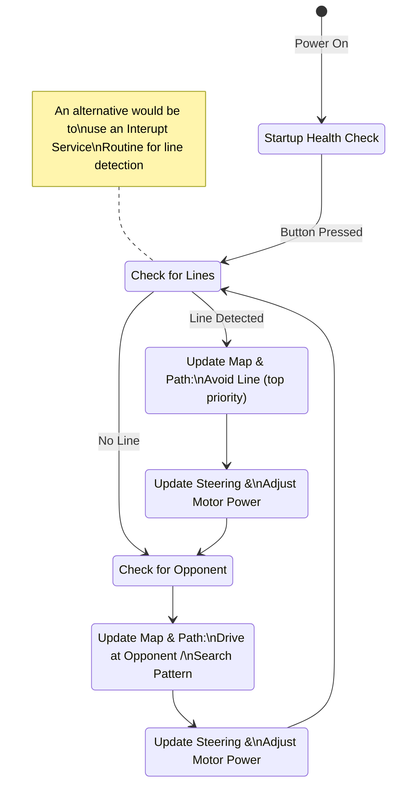

# B.O.B. Behaviour Overview

# Navigation

### Inputs

* wheel encoders using ISR
* line sensors (IR x 4)
* object sensors (ultrasonic x ?)

### Map

Array that tracks the location of the bot, opponent (or last known location of opponent) and lines. As time passes localization gets less accurate, so should we remove or de-value data as it gets older? The location of the bot can be tracked by array indices giving the cell that the centre of the robot is in, and a vector for the direction it is facing.

### Path

Algorithm that decides which way the bot should be facing and the speed that it should be going at, based on avoiding lines (highest priority) and finding or attacking the opponent.
