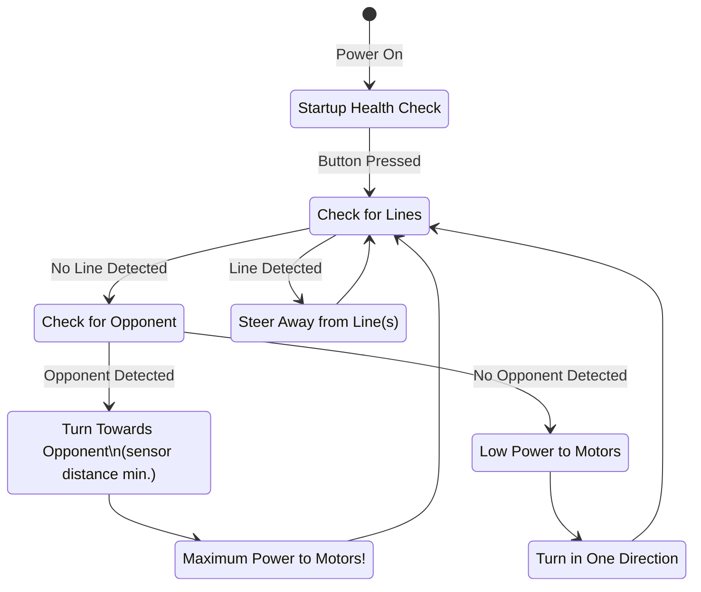

# B.O.B. Behaviour Overview

# Navigation

### Inputs

* line sensors (IR x 2)
* object sensors (ultrasonic x 4)

### Map

Not used in the simple behaviour model.

### Path

Not used in the simple behaviour model.
